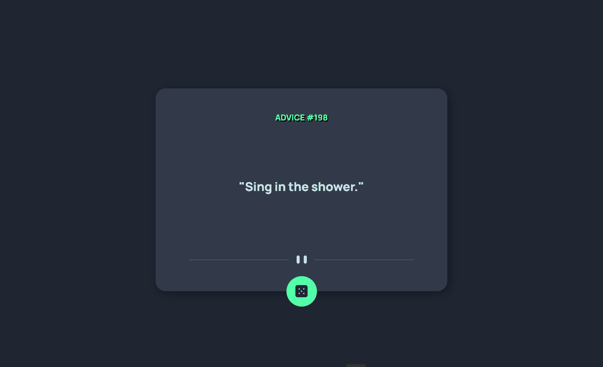

# Gerador de Conselhos

### Um projeto do curso DevQuest que usa uma API para Gerar conselhos aleatórios.

## Link para <a href="https://filipe-dll.github.io/Gerador-de-conselhos/">Visualizar projeto</a>